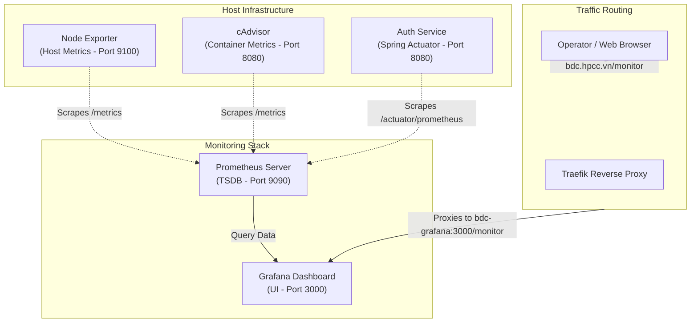

# BDCHub Monitoring Stack

[](https://www.docker.com/)
[](https://prometheus.io/)
[](https://grafana.com/)
[](https://traefik.io/)

A production-ready, Dockerized monitoring solution tailored for the **BDCHub** ecosystem. This stack automates the collection, aggregation, and visualization of host-level, container-level, and application-specific metrics.

---

## 🗺️ System Architecture

The following diagram illustrates the flow of metrics collection and web traffic routing through the stack:



---

## ✨ Features

- **Automated Provisioning**: Fully automated datasource configuration and dashboard ingestion on startup.
- **Multi-Level Monitoring**:
  - **Host Infrastructure**: CPU, Memory, Disk, and Network monitoring via **Node Exporter**.
  - **Container Analytics**: Real-time resource usage (CPU, RAM, I/O) of all running containers via **cAdvisor**.
  - **Application Performance (APM)**: Direct scraping from Spring Boot Actuator endpoints (e.g., `auth-service`).
- **Cross-Platform Bootstrapping**: Quick start shell script (`setup.sh`) and PowerShell script (`setup.ps1`) for downloading, repairing, and preparing community dashboards.
- **Subpath Routing Ready**: Pre-configured to run under the `/monitor` subpath (e.g. `bdc.hpcc.vn/monitor`) to seamlessly integrate with your main domain.
- **Log Management**: Pre-configured JSON file log rotation policy limiting space consumption to max 30MB per container.

---

## 📁 Repository Structure

```text
BDCmonitoring/
├── docker-compose.yml       # Docker services configuration
├── setup.sh                 # Unix/Linux bootstrap script
├── setup.ps1                # Windows PowerShell bootstrap script
├── prometheus/
│   └── prometheus.yml       # Scrape jobs and target definitions
└── grafana/
    ├── provisioning/        # Grafana config provisioning
    │   ├── dashboards/
    │   │   └── dashboards.yml
    │   └── datasources/
    │       └── datasource.yml
    └── dashboards/          # JSON Dashboards repository (populated by setup scripts)
```

---

## ⚙️ Prerequisites

Before launching the stack, ensure you have the following installed and configured:

1. **Docker Engine & Docker Compose** (v2.x or higher)
2. **Network Dependency**: The stack connects to an external network named `bdcapp_app-network` by default. You can create this manually or configure it via compose project name variables.
   
   To create the network manually:
   ```bash
   docker network create bdcapp_app-network
   ```

---

## 🚀 Getting Started

Follow these steps to configure and boot the monitoring environment:

### Step 1: Run the Bootstrap Script
The bootstrap script creates local directories, pulls the latest production-grade Grafana dashboards, and patches the Prometheus datasource binding issues.

**On Linux/macOS:**
```bash
chmod +x setup.sh
./setup.sh
```

**On Windows (PowerShell):**
```powershell
.\setup.ps1
```

### Step 2: Environment Configuration (Optional)
Customize your deployment by creating a `.env` file in the root directory:

```env
COMPOSE_PROJECT_NAME=bdcapp
GRAFANA_ADMIN_USER=admin
GRAFANA_ADMIN_PASSWORD=your_secure_password
GRAFANA_PORT=3010
```

### Step 3: Launch the Stack
Deploy the services in detached mode using Docker Compose:

```bash
docker compose up -d
```

---

## 📊 Access & Usage

Once deployed, you can access the tools through the following ports:

| Service | Port (Internal) | Port (Host Default) | External Routing (Subpath) |
| :--- | :--- | :--- | :--- |
| **Grafana** | `3000` | `3010` | `bdc.hpcc.vn/monitor` (via Next.js/Reverse Proxy) |
| **Prometheus** | `9090` | *Internal Only* | *N/A* |
| **Node Exporter** | `9100` | *Internal Only* | *N/A* |
| **cAdvisor** | `8080` | *Internal Only* | *N/A* |

### Next.js Proxy Integration (Option 2 Setup)
Since Grafana is configured to run under the `/monitor` subpath, you need to configure your Next.js application (`bdc-frontend`) to proxy these requests. Add the following block to your `next.config.js` file:

```javascript
module.exports = {
  async rewrites() {
    return [
      {
        source: '/monitor/:path*',
        destination: 'http://bdc-grafana:3000/monitor/:path*',
      },
    ]
  },
}
```
*Note: If Next.js and Grafana are not running in the same Docker network, replace `bdc-grafana:3000` with your VM's IP address and Grafana's host port (e.g., `http://<VM_IP>:3010/monitor/:path*`).*

### Pre-loaded Dashboards
The setup process installs two dashboard categories out of the box in Grafana:
1. **Node Exporter Full** (ID: `1860`): Total machine resources (Disk I/O, Network traffic, Memory/CPU utilization).
2. **Docker Containers** (ID: `14282`): Aggregated and container-by-container resource limits and current consumption.

---

## 🛠️ Configuration & Customization

### 1. Adding a New Target to Prometheus
To monitor an additional application or service, add its address to [prometheus.yml](file:///d:/CodeSpace/BDCHub/BDCmonitoring/prometheus/prometheus.yml):

```yaml
  - job_name: 'my-new-service'
    metrics_path: '/actuator/prometheus' # Optional if using Spring Boot
    static_configs:
      - targets: ['my-new-service:8080']
```
After modifying the file, trigger Prometheus configuration reload without restarting the container:
```bash
curl -X POST http://localhost:9090/-/reload
```
*(Note: `--web.enable-lifecycle` is enabled to allow this dynamically).*

### 2. Updating Grafana Dashboards
To add more permanent dashboards to Grafana:
1. Export the dashboard in JSON format from Grafana UI or find one on [Grafana Dashboard Library](https://grafana.com/grafana/dashboards/).
2. Place the JSON file under the `./grafana/dashboards` directory.
3. Grafana automatically registers and hot-reloads dashboard changes.

---

## ⚡ k6 Performance Testing Suite

This repository contains the **BDC Performance Testing Suite** under the `./performance-tests/` directory. It enables standalone load, stress, spike, and soak testing of the BDC LMS microservices, with real-time metric streaming to Prometheus.

### Structure
- `performance-tests/docker-compose.k6.yml`: Docker Compose configuration for standalone k6 execution.
- `performance-tests/k6_student_flow.js`: Student learning and interaction flow.
- `performance-tests/k6_teacher_flow.js`: Teacher dashboard and editing flow.
- `performance-tests/k6_admin_flow.js`: Admin lakehouse metrics and export flow.
- `performance-tests/k6_multi_role_flow.js`: Combined multi-role workload.
- `performance-tests/seed_users.sql` & `cleanup_users.sql`: SQL scripts to seed/cleanup test accounts.

### Execution Guide

#### Step 1: Seed the databases
Run the respective sections of [seed_users.sql](./performance-tests/seed_users.sql) on the Auth (port `5433`) and LMS (port `5434`) databases.

#### Step 2: Restart Prometheus to enable Remote Write
Ensure Prometheus is running with remote write receiver enabled (configured by default in `docker-compose.yml`):
```bash
docker compose up -d --force-recreate prometheus
```

#### Step 3: Execute tests and push metrics
Run k6 using Docker Compose, linking it to the internal network to push metrics:
```bash
# Run a Student Load Test
docker compose -f performance-tests/docker-compose.k6.yml run --rm --network=app-network k6 run -o experimental-prometheus-rw=server-url=http://bdc-prometheus:9090/api/v1/write k6_student_flow.js

# Run a Teacher Stress Test
TEST_TYPE="stress" docker compose -f performance-tests/docker-compose.k6.yml run --rm --network=app-network k6 run -o experimental-prometheus-rw=server-url=http://bdc-prometheus:9090/api/v1/write k6_teacher_flow.js
```

#### Step 4: Monitor on Grafana
Open Grafana (`https://bdc.hpcc.vn/monitor/` or port `3010`) and view the **k6 Performance Test Dashboard** (`k6-performance.json`) for live metrics.

---

## 🔒 Security Best Practices

1. **Change Default Credentials**: Never run the stack in production with default credentials. Set the `GRAFANA_ADMIN_PASSWORD` env variable to a secure string.
2. **Network Isolation**: Only Grafana is exposed externally or bound to host port by default. Keep Prometheus, cAdvisor, and Node Exporter within the private `app-network`.
